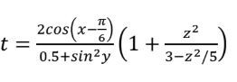
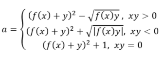
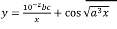

# Gusakov_323
## Дисциплина: Поддержка и тестирование программных модулей
## Группа: 3ИСиП-323
## Разработчик: Гусаков Дмитрий Павлович
## Вариант 1
# Калькулятор уровнений
Программа для помощи решения уравнений. Можно выбрать значения подстроенные под готовые уравнения описанные внизу. Программа имеет навигацию 3 страниц, проверки на пустые и неккоректные значения и визуальное удобство. По умолчанию уже стоят значения.
# Уравнения
## 1 уравнение
## 
При заполненнии этого уравнения нужно вписать x, y, z
## 2 уравнение
## 
При заполненнии этого уравнения нужно вписать x, y и выбрать одно из трех (sh(x), x^2, e^x)
## 3 уравнение
## 
При заполненнии этого уравнения нужно вписать x0, xk, dx, a, b, c
